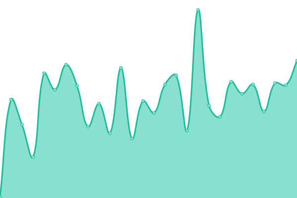

# [📈 Live Status](https://demo.upptime.js.org): <!--live status--> **🟩 All systems operational**

This repository contains the open-source uptime monitor and status page for [Seungjin Kim](https://demo.upptime.js.org), powered by [Upptime](https://github.com/upptime/upptime).

With [Upptime](https://upptime.js.org), you can get your own unlimited and free uptime monitor and status page, powered entirely by a GitHub repository. We use [Issues](https://github.com/seungjin/uptime/issues) as incident reports, [Actions](https://github.com/seungjin/uptime/actions) as uptime monitors, and [Pages](https://demo.upptime.js.org) for the status page.

<!--start: status pages-->
<!-- This summary is generated by Upptime (https://github.com/upptime/upptime) -->
<!-- Do not edit this manually, your changes will be overwritten -->
<!-- prettier-ignore -->
| URL | Status | History | Response Time | Uptime |
| --- | ------ | ------- | ------------- | ------ |
|  [seungjin.net](https://seungjin.net) | 🟩 Up | [seungjin-net.yml](https://github.com/seungjin/uptime/commits/HEAD/history/seungjin-net.yml) | 

 1888ms
     
 | 

<a href="https://uptime.seungjin.net/history/seungjin-net">99.82%</a>
    

|  [www.seungjin.net](https://www.seungjin.net) | 🟩 Up | [www-seungjin-net.yml](https://github.com/seungjin/uptime/commits/HEAD/history/www-seungjin-net.yml) | 

 1387ms
     
 | 

<a href="https://uptime.seungjin.net/history/www-seungjin-net">99.82%</a>
    

|  [mastodon (mstd.seungjin.net)](https://mstd.seungjin.net) | 🟩 Up | [mastodon-mstd-seungjin-net.yml](https://github.com/seungjin/uptime/commits/HEAD/history/mastodon-mstd-seungjin-net.yml) | 

 714ms
     
 | 

<a href="https://uptime.seungjin.net/history/mastodon-mstd-seungjin-net">100.00%</a>
    

|  [uptime (uptime.seungjin.net)](https://uptime.seungjin.net) | 🟩 Up | [uptime-uptime-seungjin-net.yml](https://github.com/seungjin/uptime/commits/HEAD/history/uptime-uptime-seungjin-net.yml) | 

 189ms
     
 | 

<a href="https://uptime.seungjin.net/history/uptime-uptime-seungjin-net">100.00%</a>
    

<!--end: status pages-->

[**Visit our status website →**](https://demo.upptime.js.org)

## 📄 License

- Powered by: [Upptime](https://github.com/upptime/upptime)
- Code: [MIT](./LICENSE) © [Seungjin Kim](https://demo.upptime.js.org)
- Data in the `./history` directory: [Open Database License](https://opendatacommons.org/licenses/odbl/1-0/)
